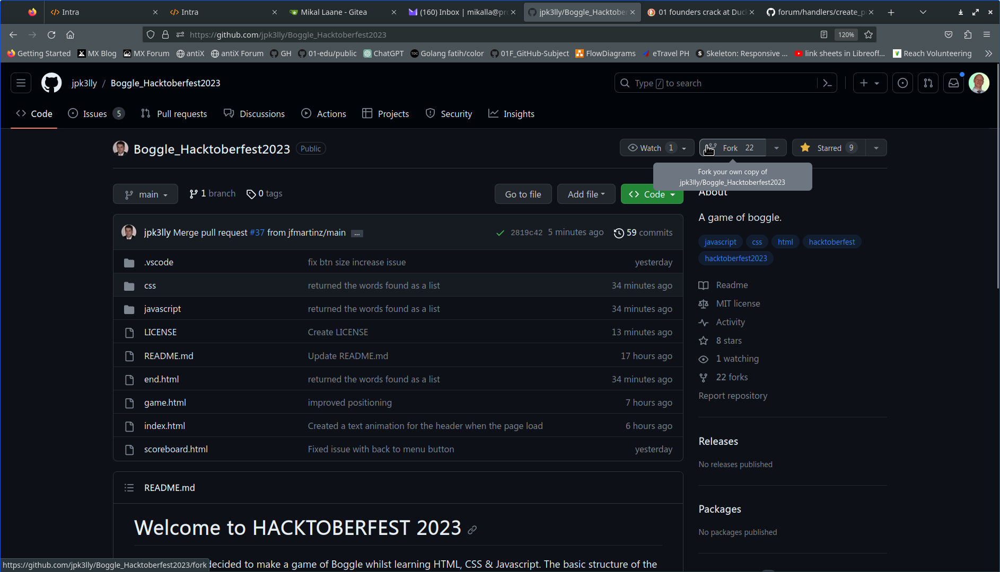
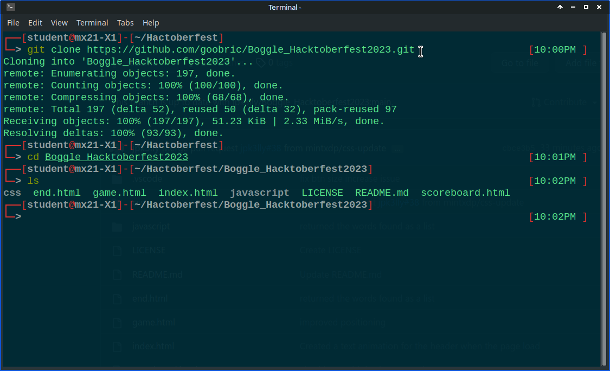

## Here are instructions on how to Fork, Clone, New Branch, Make Changes, Pull Request.

- [Fork](#fork)
- [Clone](#clone)
- [New Branch](#new-branch)
- [Make Changes](#make-changes)
- [Pull Request](#pull-request)

### Fork

'forking' is a term used in github to copy a repository from a project into your github account.

1. Click on the Fork button in the top right of the page, under the main title.

   

1. This will open a new window with your github account followed by the repository you are copying. Click the green Create fork button to copy this repository into your github account.
   

1. A window will open with your github account showing the repository you have just copied. Under the title of the repository, it will state 'forked from' with the name of the project owner, and the name of the repository.
   

### Clone

'cloning' is a term used in github to copy a repository to your computer, creating a copy of the folders and files on the hard drive of your computer.

1. Click the green Code button a dropdown menu will appear. Click on the icon with the two squares next to the url to copy it.
   

1. A green check/tick mark will appear and a button with Copied. This copied url link will be needed to clone the repository to the computer.
   

1. Install Git (Version Control System) on your computer via this link [Git download](https://git-scm.com/download)

   - Git is needed to store and track any changes made to the downloaded repository, that is on the computer.
   - Git is used to 'push' any changes made to the downloaded repository back to github.

1. Open a terminal on your computer:

   - Apple Mac: click on Spotlight search and type the word terminal
   - Windows: install Git Bash and open the program
   - Linux: press the keyboard combination Ctrl+Alt+T

1. Navigate to the folder on your computer where you want to copy the github repository. Type 'git clone' and paste the repository url; then press enter on the keyboard.
   
   Open the folder that has just been created, the contents of the repository will be shown.

### New Branch

github uses the Tree as a visual analogy of file
